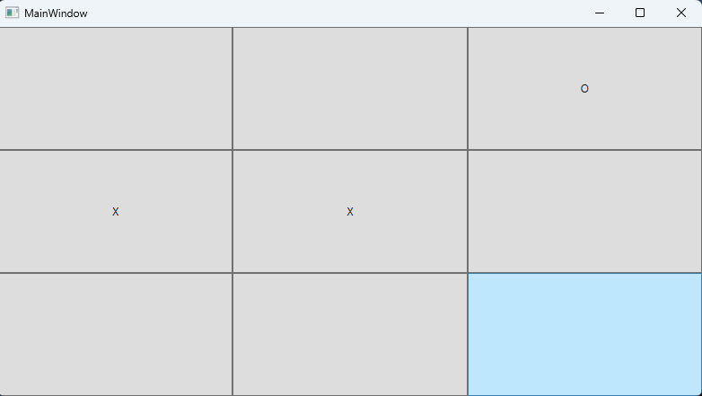
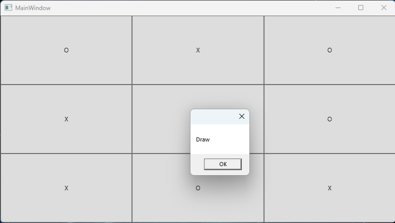
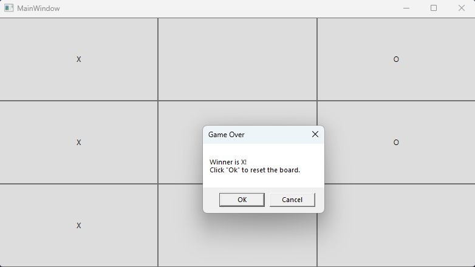

# WPF TIC TAC TOE

GUI implemented using WPF, while the logic for the game is in the BoardLogic project.
This means theres a clear sepaation from the "front-end" and the "back-end" of the application for better maintainability.

To run the source code, you will need .Net 7.0 installed and either run the project from the VS 2022 or with the dotnet cli command from the running directory:

```
dotnet run
```




